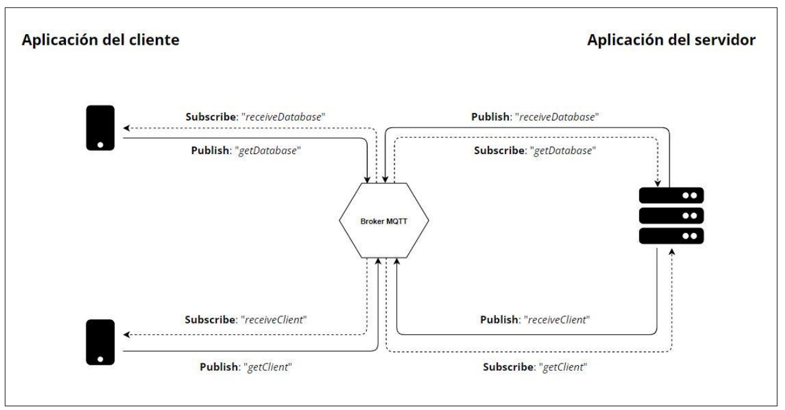
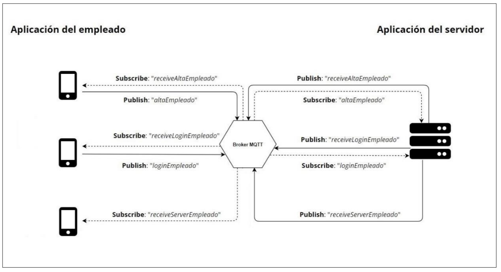
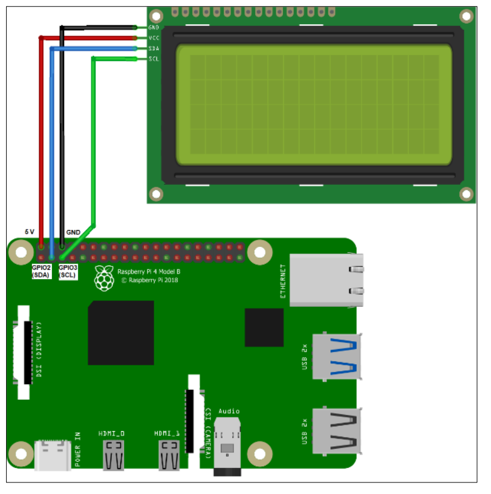
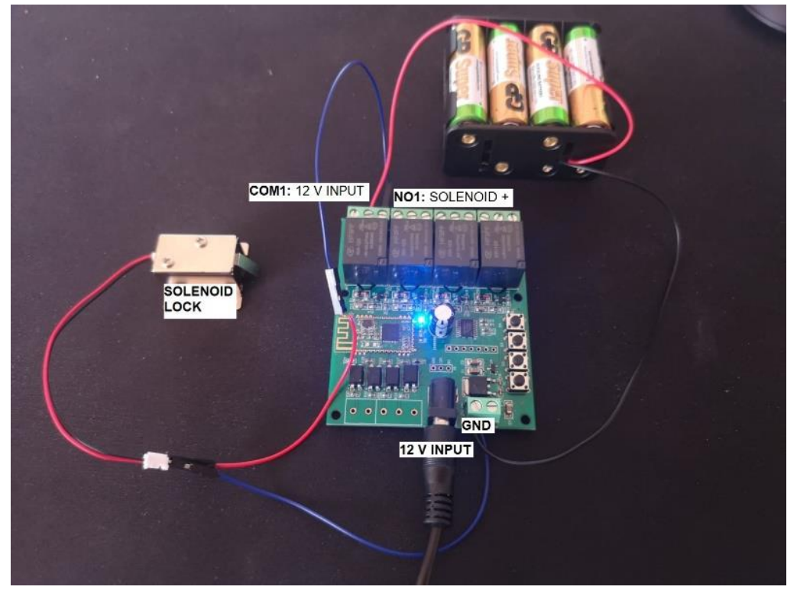
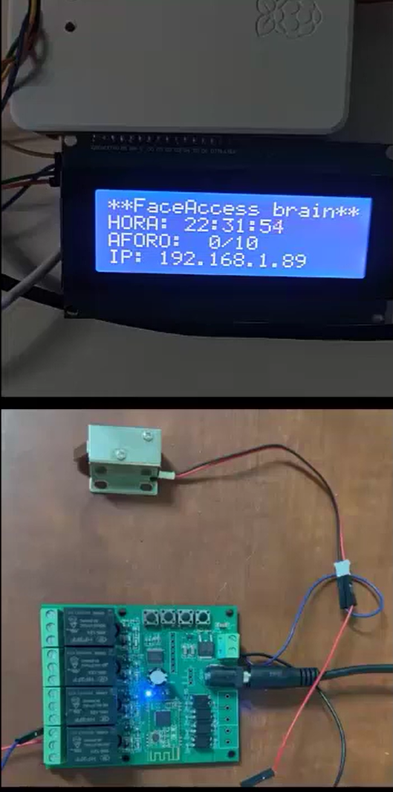

# FaceAccess Server

Este proyecto corresponde con el backend del servicio para el funcionamiento del sistema de control de acceso FaceAccess.

En ella se controlarán todas las comunicaciones entre base de datos y cliente. Para dicha comunicación se empleará el protocolo MQTT, el cual permite comunicar de forma rápida y eficiente dispositivos de IoT, para llevar a cabo esta comunicación, se emplearán diferentes tópicos gestionados por un broker llamado Mosquitto. 

Para ello se han seguido dos arquitecturas, la primera para la comunicación entre servicio y aplicación del cliente (FaceAccess Client), y la comunicación entre servicio y aplicación del empleado (FaceAccess Employee).


*[1] Comunicación entre FaceAccess Client y servidor*


*[2] Comunicación entre FaceAccess Employee y servidor*


## *Hardware*

La lógica del servidor será instalada en una Raspberry Pi 4, en la cual incorporaremos diversos elementos.

El primero es una pantalla LCD, en la cual mostraremos información básica del sistema tales como el aforo actual, o la dirección IP del servidor (importante para conectar nuestras aplicaciones móviles a este servidor). Para ello emplearemos I2C con el siguiente esquema:


*[3] LCD Raspberry Pi 4*

Luego se instalará un sistema de cerrojo, el cual funciona mediante una señal enviada desde FaceAccess Client en caso de conceder el acceso a un cliente. Para ello haremos uso de un relé, el cual dispone de un chip Bluetooth.


*[4] Esquema del cerrojo conectado al relé*

Finalmente, tendremos el hardware preparado:


*[5] Instalación final*


## *Instalación del servidor*

Si desea compilar este proyecto debe realizar una serie de pasos para que todo el proceso sea exitoso.

### *1) Sustitución del path*

Primero debes modificar el fichero *face_access_server.py*, en la línea 73 y 74 debes sustituir el path actual por el nuevo.

Debes hacerlo de la misma forma en el fichero *crontab_execute_server.py* (línea 27).

### *2) Instalación del broker Mosquitto*

Debe instalar en su Sistema Operativo el broker Mosquitto.

   ```sh
   sudo apt-get update

   sudo apt-get install mosquitto

   sudo apt-get install mosquitto-clients
   ```

### *3) Instalación de PostgreSQL*

Debe instalar en su Sistema Operativo el SGBD PSQL.

   ```sh
   sudo apt-get install postgresql
   ```

El siguiente paso es crear su base de datos. Para ello crea las siguientes tablas:

----------------------------------------------------

   ```sql
   CREATE TABLE certificados(
    id_certificado VARCHAR(20) PRIMARY KEY,
    uso INTEGER NOT NULL);

   CREATE TABLE cliente(
    id SERIAL PRIMARY KEY,
    certificate_id VARCHAR(40) NOT NULL UNIQUE,
    nombre VARCHAR(20) NOT NULL,
    apellidos VARCHAR(50) NOT NULL,
    fecha VARCHAR(10) NOT NULL,
    puntos TEXT NOT NULL,
    presente INT2 NOT NULL,
    photo TEXT NOT NULL);

   CREATE TABLE empleado(
    nickname VARCHAR(10) PRIMARY KEY,
    pwd VARCHAR(20) NOT NULL,
    nombre VARCHAR(20) NOT NULL,
    apellidos VARCHAR(50) NOT NULL,
    id_cert VARCHAR(20) NOT NULL UNIQUE,
    id_onesignal VARCHAR(50) NOT NULL UNIQUE);

    CREATE TABLE establecimiento(
        id_establecimiento SERIAL PRIMARY KEY,
        nombre VARCHAR(20) NOT NULL,
        propietario VARCHAR(20) NOT NULL,
        aforo_actual INTEGER NOT NULL,
        aforo_maximo INTEGER NOT NULL,
        menores INTEGER NOT NULL,
        registro INTEGER NOT NULL);

    CREATE TABLE registro(
        certificate_id VARCHAR(40) PRIMARY KEY,
        nombre VARCHAR(20) NOT NULL,
        apellidos VARCHAR(50) NOT NULL,
        fecha VARCHAR(10) NOT NULL);
   ```

----------------------------------------------------

Luego debe insertar una fila en la tabla establecimiento, indicando los datos de su local.

Ahora debe ir a la carpeta servers, y modificar ambos ficheros de Python. En las primeras líneas de código aparece la conexión con base de datos. Para ello debe introducir las credenciales de su propia base de datos:

   ```py
   conn = psycopg2.connect( database="nombre_de_tu_db", user='tu_usuario', password='tu_password', host='localhost', port= '5432')
   ```

### *4) Instalación de liquidcrystal_i2c*

En el caso de que la Raspberry Pi 4 se conecte a un LCD 20x4 mediante el BUS I2C, puede instalar la librería correspondiente, de esta forma obtendrá información en el display.

*https://github.com/johnrickman/LiquidCrystal_I2C.git*


### *5) CRONTAB*

El último paso para la instalación del servidor es modifcar el crontab del SO para que a los 30 segundos de encenderse el SO, ejecutar el fichero *crontab_execute_server.py*
